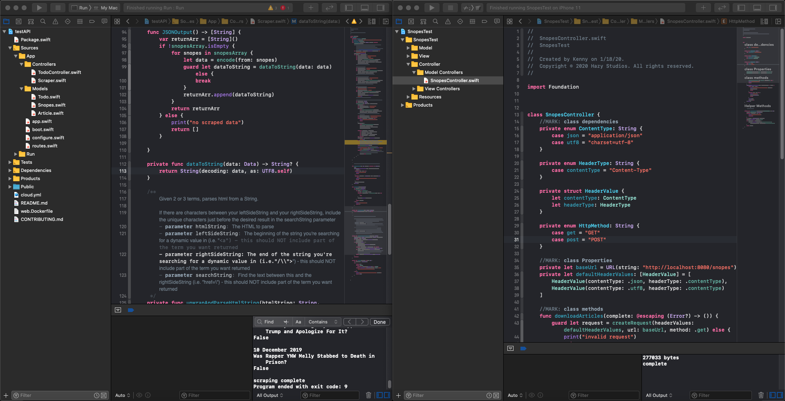

<h3>This backend built with:</h3>

    
     
     
    
    
    
    
    

# Push Snopes to Firebase branch

The "/snopes" endpoint will be used to trigger an async function that pushes the JSON to Firebase Realtime Database via the REST API

 
 

# 2 Apps, 1 language, full stack!

## Backend Running on localhost

<caption>Backend server running on Vapor written in Swift</caption>

### The server runs a script that scrapes https://snopes.com/fact-check
An object holding text variables is initialized using dynamic values and encoded into JSON. The JSON is made available on a GET endpoint ("http://localhost:8080/snopes")

## Frontend Running on device

<caption>Front End App running on iPhone 11 Simulator</caption>

### The Frontend downloads JSON data and decodes into identical object (Data model was literally copy/pasted with 1 minor change - encodable conformity was changed to decodable conformity)
The results are displayed on a tableView. One of the scraped variables is the article's text in html. This is displayed on a detail view using a WkWebview.

Normally something even this simple would require the use of at least 2 programming languages (one to create a web-facing interface using a server-side language such as node.js) and one for the frontend (using Swift for both in this case).

I was able to put this together in just a couple hours, using a process I'm wholly unfamiliar with. The convenience of using one development environment and one language is priceless. Encoding/decoding is a breeze, data modeling - not even a concern.
